# Mini Project Advanced GitOps Techniques

## Module 5: Advanced GitOps Techniques and Real-World Scenarios.

### Introduction

This module takes learners through advanced GitOps techniques using ArgoCD, focusing on real-world applications like multi-cluster deployments, microservices architectures, and integrating ArgoCD into CI/CD pipelines.
By the end of this module, learners will be equipped to handle complex Kubernetes deployments and understand how GitOps principles apply in various scenarios.


**Lesson 5.1: Deploying Multi-Cluster and Microservices**

**Architectures with ArgoCD**

**Objective**

Develop proficiency in deploying applications across multiple Kubernetes clusters and managing complex microservices architecture using ArgoCD.

**Steps**

## 1.  **Setting Up Multi-Cluster Environment:**

  **Configuring Multiple Kubernetes Clusters:**

  - Set up distinct Kubernetes environments. This could involve creating multiple clusters on AWS EKS for a more realistic production setup, or using minikube for a simplified local development environment.

  - Environment each cluster is accessible and properly configured (with contexts set up in your `kubeconfig` file).

  **Registering Clusters with ArgoCD:**

  - Use the `argocd` CLI to add each Kubernetes cluster to ArgoCD's management.

  - Code Snippet:  `winget install --id ArgoProj.ArgoCD`

    There are several ways to create separate **Amazon EKS** clusters for **development** and **production**. The recommended approach is to create two **independent EKS clusters** one for each environment.

    In this task I prefer to use `eksctl` for this task.
    below is the command to create **development cluster**


```
eksctl create cluster \
  --name dev-cluster \
  --region us-east-1 \
  --version 1.33 \
  --nodegroup-name dev-workers \
  --node-type t3.medium \
  --nodes 2 \
  --managed
```
    
**Create the production cluster:**

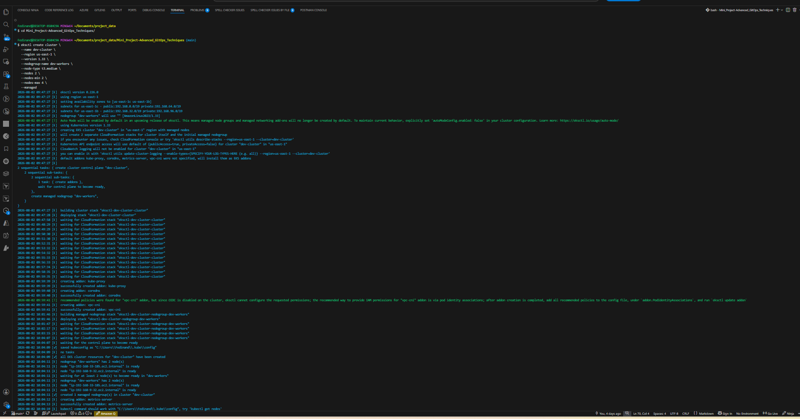


```
eksctl create cluster \
  --name prod-cluster \
  --region us-east-1 \
  --version 1.33 \
  --nodegroup-name prod-workers \
  --node-type t3.medium \
  --nodes 3 \
  --managed
```

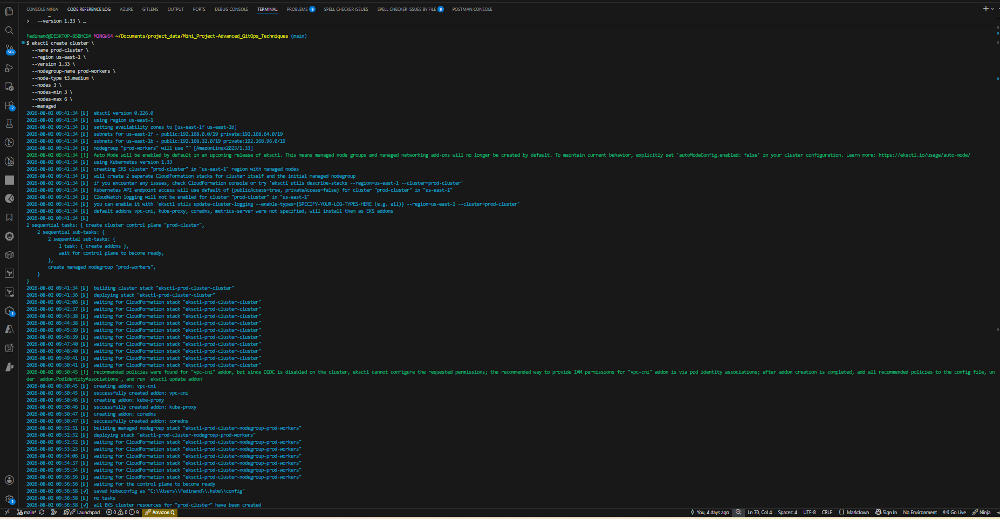


Use this command below to verify the creation of the two clusters.

```
eksctl get clusters
```

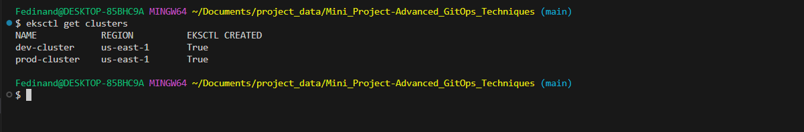

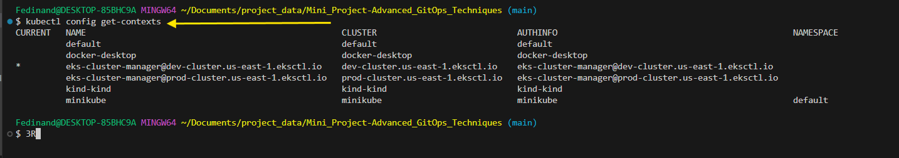


```
argocd cluster add CONTEXT_NAME
```

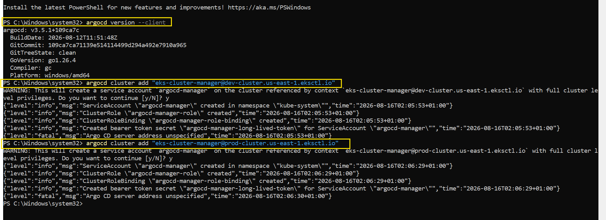


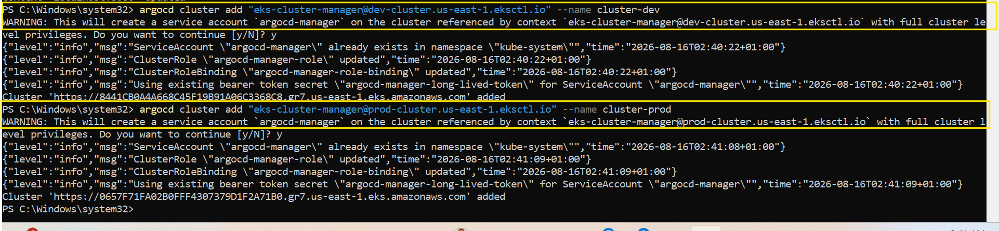


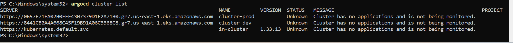

- Explanation: This command registers a Kubernetes cluster with ArgoCD. `CONTEXT_NAME` refers to the cluster's context name in your `kubeconfig` file, allowing ArgoCD to manage resources in that cluster.


*****************************************************************************************

## 2. **Deploying Applications to Multiple Clusters:**

  **Creating Application Definitions for Each Cluster:**

  - Define an ArgoCD application in YAML format for deployment in each cluster. These applications can point to the same or different Git repositories depending on your deployment strategy.

  - Customize applications for each cluster by using different namespaces, resource limits, or feature flags.

  - Example:

```
apiVersion: argoproj.io/v1alpha1
kind: Application
metadata:
  name: my-app-prod
  namespace: argocd
spec:
  destination:
    name: ''
    namespace: prod-namespace
    server: 'https://kubernetes.default.svc'
  source:
    path: prod
    repoURL: 'https://git.example.com/my-app.git'
    targetRevision: HEAD
```


After the deployment of eks-clusters, argocd have to be installed the cluster's but before then argocd namespace has to be created.

1. Create the `argocd` namespace

```
kubectl create namespace argocd
```
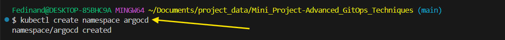

Then, verify the with

```
kubectl get namespace argocd
```

Then, Install argo cd by running the command below:

```
kubectl apply -n argocd -f https://raw.githubusercontent.com/argoproj/argo-cd/stable/manifests/install.yaml
```

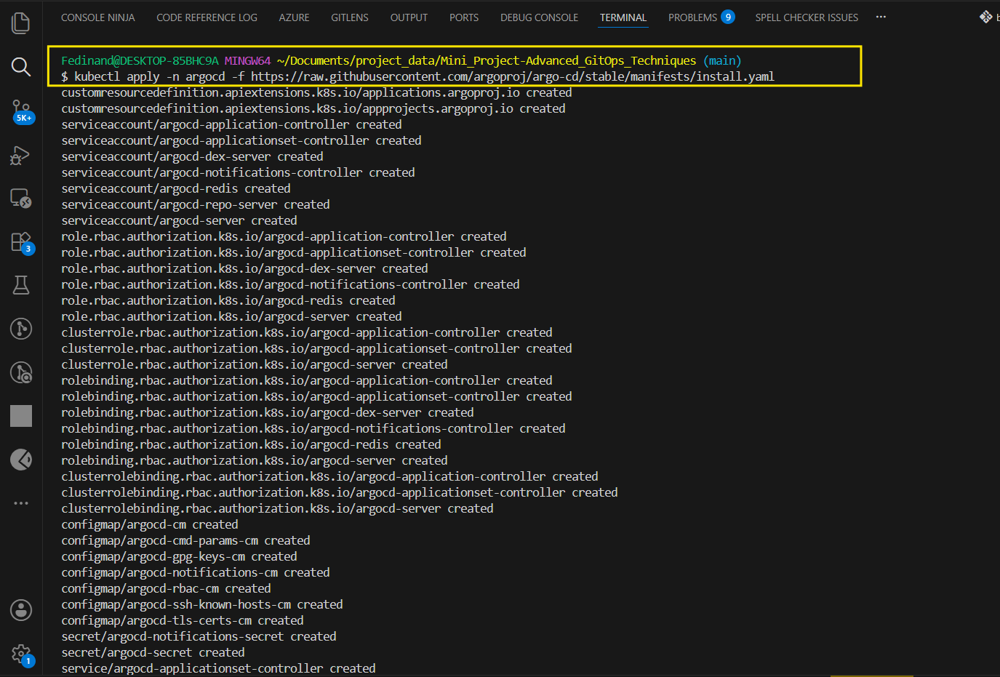

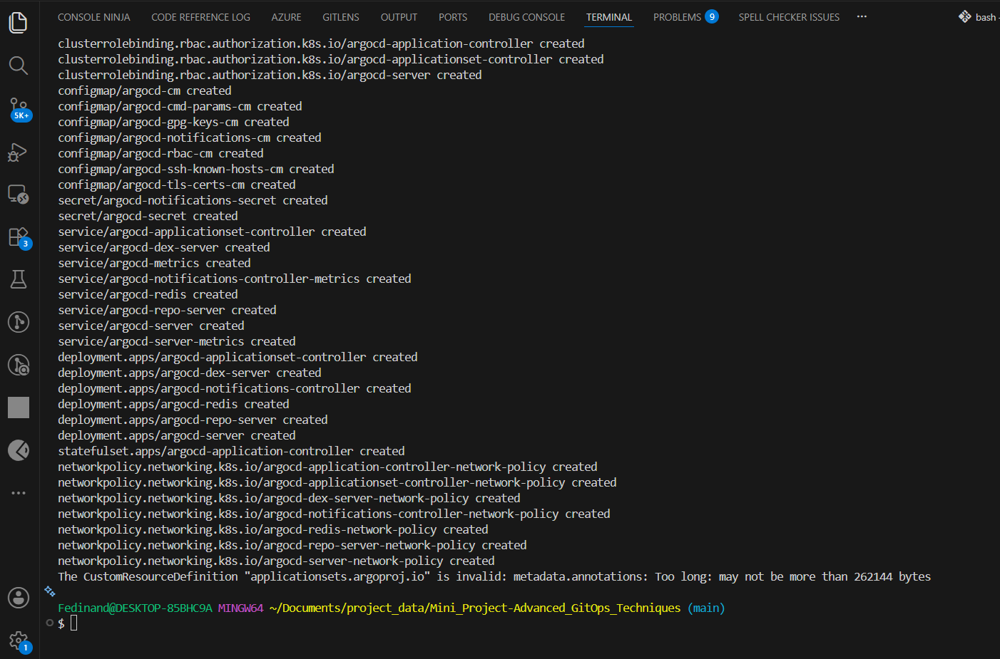

Then after the installation process above, then proceed with the command below to apply those applications.

```
kubectl apply -f argocd/frontend-dev.yaml
```

```
kubectl apply -f argocd/backend-dev.yaml
```

```
kubectl apply -f argocd/frontend-prod.yaml
```

```
kubectl apply -f argocd/backend-prod.yaml
```

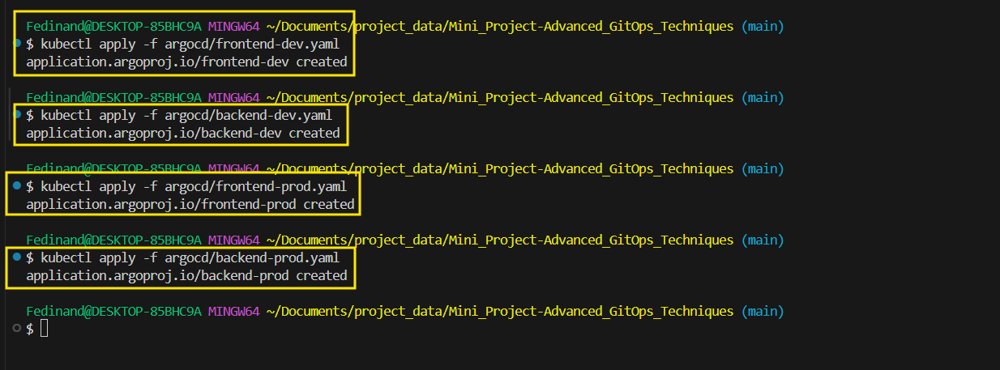

Here is the structure for this project.


- Explanation: This defines an ArgoCD application for a production environment, pointing to the `prod` directory in the Git Repository.

After the first stage based of the project structure, below is the next stage, the directory structure will look like this:


Below is the command to create the kubernetes directory above.


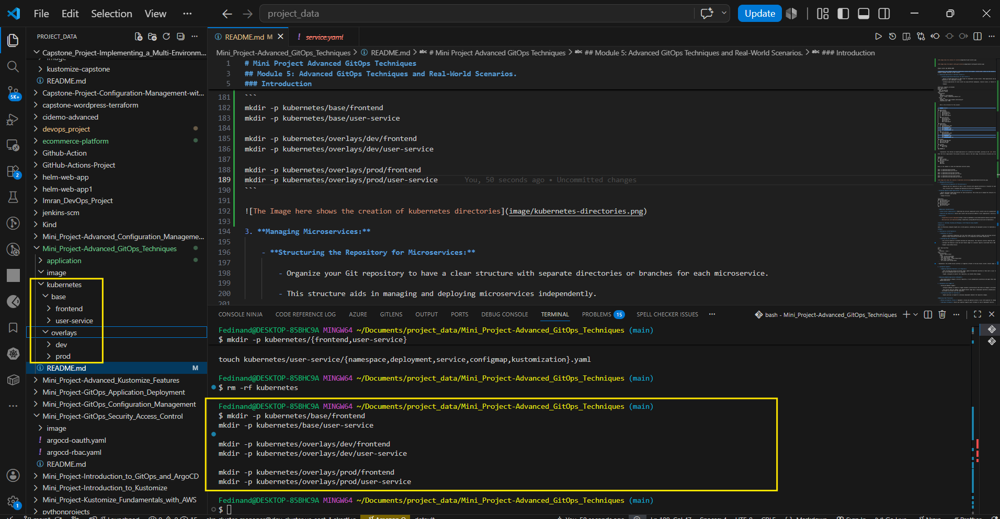


*********************************************************************************************

## 3. Managing Microservices:

  **Structuring the Repository for Microservices:**

  - Organize your Git repository to have a clear structure with separate directories or branches for each microservice.

  - This structure aids in managing and deploying microservices independently.

**Creating Separate ArgoCD Applications for Each Microservice:**
    
  - Define individual ArgoCD applications for each microservice. This allows you to manage the lifecycle of each microservice independently, facilitating updates, rollbacks, and scaling.

  - Example Structure:

```
repository/
├── microservice-1/
│   ├── deployment.yaml
│   └── service.yaml
├── microservice-2/
│   ├── deployment.yaml
│   └── service.yaml
└── 
```

  **Additional Considerations**

  - **Inter-Cluster Communication:** Understand how services communicate across clusters and set up appropriate networking and service discovery mechanisms.

  - **Security and Compliance:** Ensure each cluster and microservice adheres to your organization's security policies and compliance requirements.

  **Resources**

    - [ArgoCD Multi-Cluster Deployment](https://argo-cd.readthedocs.io/en/stable/operator-manual/cluster-bootstrapping/)

    - [Microservices with Kubernetes](https://kubernetes.io/blog/2021/07/23/microservices-on-kubernetes/)

*******************************************************************************************


# Lesson 5.2: Workshop: Building and Managing a CI/CD Pipeline Using ArgoCD

**Objective**

Learn to effectively integrate ArgoCD into a CI/CD pipeline, automating the deployment process for Kubernetes applications. 

**Steps**

## 1. **Setting Up a CI/CD Pipeline:**

   **Choosing a CI Tool:**

  - Select a Continuous Integration (CI) tool that aligns with your project's needs and existing infrastructure. Popular choices include Jenkins for its extensive Plugin ecosystem and GitHub Actions for its integration with GitHub repositories.

  **Configuring the CI Pipeline:**

    - Set up the CI pipeline to automate building your application. This typically involves compiling code, running tests, and building Docker images.

    - Configure the Pipeline to push the built Docker image to a container registry (like Docker Hub or AWS ECR).

    - Example using GitHub Actions:


```
name: Build and Push
on:
  push:
    branches: [ main ]
jobs:
  build-and-push:
    runs-on: ubuntu-latest
    steps:
    - uses: actions/checkout@v2
    - name: Build Docker image
      run: docker build . --tag my-app:latest
    - name: Push to Registry
      run: docker push my-app:latest
```

- Explanation: This GitHub Actions workflow is triggered on Pushes to the main branch, builds a Docker image, and then pushes it to a container registry.


**************************************************************************************

## 2. **Integrate ArgoCD:**

**Updating Kubernetes Manifests in CI Pipeline:** 

  - After building and pushing the Docker image, update the Kubernetes manifests or Helm chart in your repository to reference the new image version. This step can be automated within the CI pipeline.

  - ArgoCD, configured to monitor this repository, will delete these changes.


**Deploying Updated Application withArgoCD:**

- Once ArgoCD detects changes in the Git repository, it will automatically synchronize and apply these changes to your Kubernetes clusters, deploying the updated application.


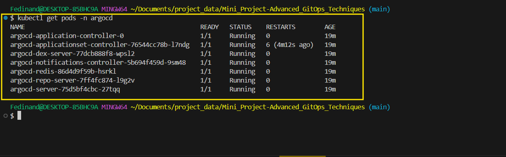


*********************************************************************************************

## 3. **Automation and Triggers:**

  - Setting Up Webhook Triggers:

  - Configure webhooks in ArgoCD to trigger automatic synchronization when there are changes in the monitored Git repository.

  - This ensures that any changes (like Updated Docker image tags in deployment manifests) automatically initiates an ArgoCD sync, keeping the Kubernetes environment up-to-date with the repository.


**Configuring ArgoCD for Auto-Sync:**

  - Enable auto-sync in ArgoCD for continuous deployment whenever the repository changes.

Here is the process of port-forwarding ArgoCD so that the UI web can be accessed locally.

```
kubectl port-forward svc/argocd-server -n argocd 8080:443
```

Then, Open this below in a browser

```
https://localhost:8080
```

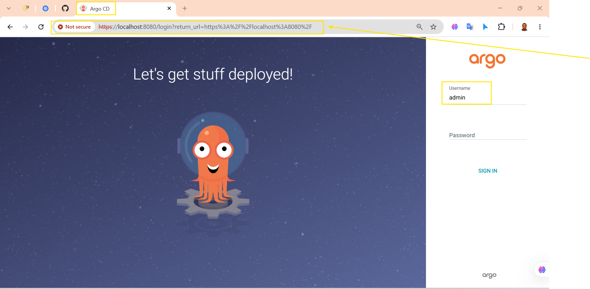


### Get the Initial ArgoCD `admin` password

```
kubectl -n argocd get secret argocd-initial-admin-secret \
  -o jsonpath="{.data.password}" | base64 -d
```

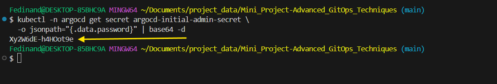


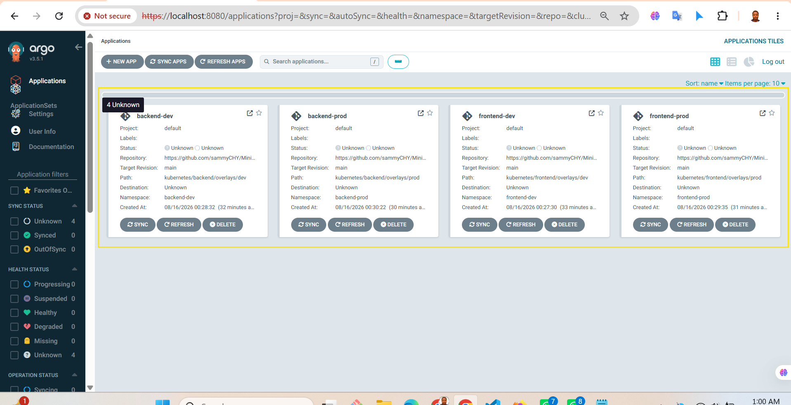

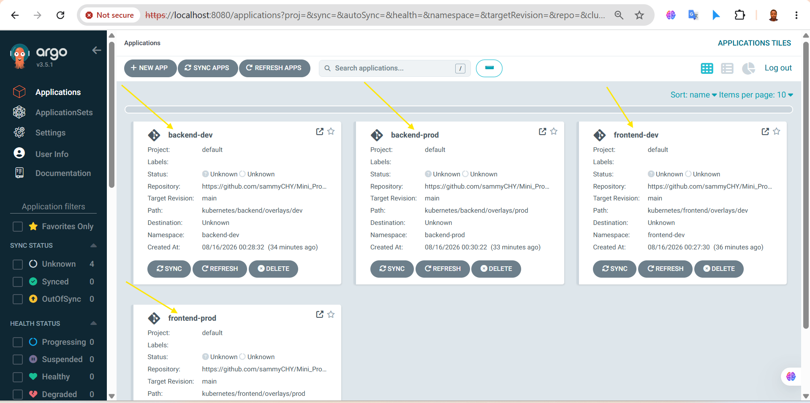


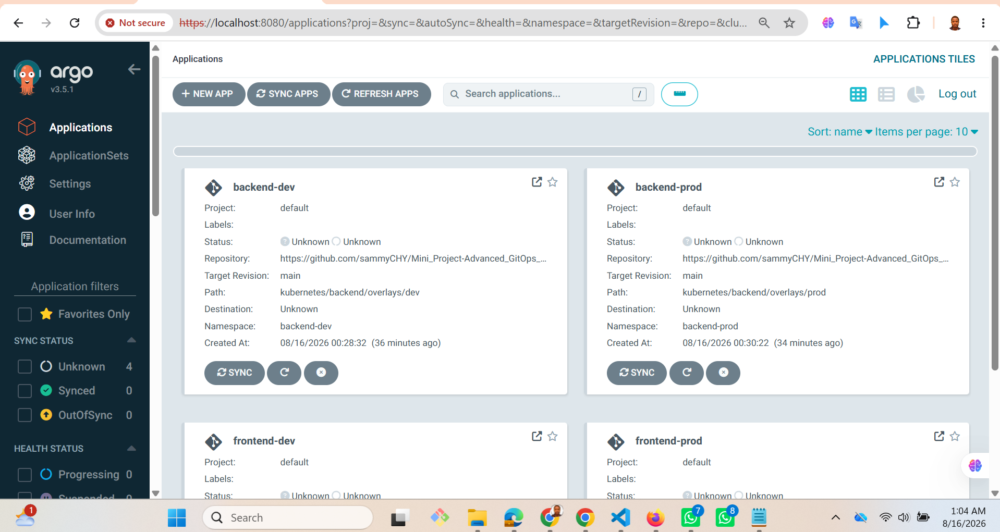

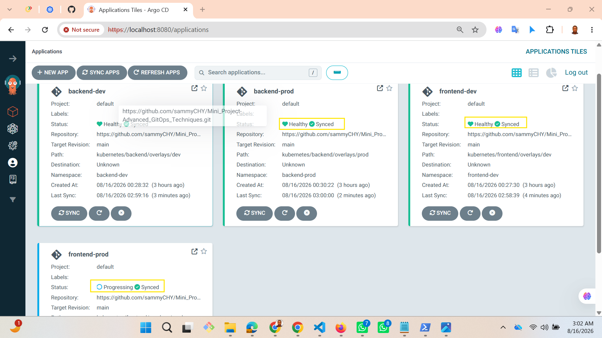


**Additional Best Practices**

- **Review and Approval Process:** Implement a review and approval process in your CI/CD pipeline for changes going into production environments.

- **Rollback Strategies:** Ensure your pipeline supports quick rollbacks in case of deployment failures.

**Resources**

[CI/CD Integration with ArgoCD](https://argo-cd.readthedocs.io/en/stable/operator-manual/ci_cd_integration/)

[Webhook Configuration in ArgoCD](https://argo-cd.readthedocs.io/en/stable/operator-manual/webhook/)
 
*************************************************************************************************************

1.  Case Study Analysis:

    Overview:

Real-world case studies provide valuable insights into how organizations implement GitOps with ArgoCD in practical scenarios. Analyzing these case studies helps learners understand different architectures, challenges faced, and the solutions ArgoCD offers.


**Steps**

   - **Reviewing Case Studies:** 

   - Visit the [ArgoCD Case Studies](https://argo-cd.readthedocs.io/en/stable/case-studies/) page to find a variety of case studies.

   - Select a few case studies relevant to the learners' interests or industry.

   ### Focus Areas:

   - Examine the architecture of each case study. Look for how ArgoCD is integrated into the organization's CI/CD Pipeline.

   - Identify challenges faced by the organizations and how ArgoCD addressed those challenges.

   - Understand the scale of deployment, whether it's a single cluster or a multi-cluster environment.


**Example:**

For instance, a case study might describe a financial institution's use of ArgoCD for managing applications across multiple Kubernetes clusters, ensuring compliance, and automating deployments.


2. **Best Practices Discussion:**

  ### Steps:

  **Repository Structure:**

    - Emphasize the importance of a well-organized structure for GitOps.

    - Discuss concepts like separating application manifests, environment-specific configurations, and shared components.

    **Handling Secrets:**

    - Address the challenges of managing secrets in GitOps.

    - Introduce tools like [Sealed Secrets](https://github.com/bitnami-labs/sealed-secrets) or [SOPS](https://github.com/getsops/sops) for secure secret management.

  ### Multi-Environment Strategies:

    - Explore strategies for managing applications in multiple environments (e.g., development, staging, production).

    - Discuss techniques for parameterizing configurations and maintaining consistency across environments.


**Example:**

A best practice could be organizing the Git repository into folders such as `applications`, `environments`, and `shared-components`. Use tools like Sealed Secrets to encrypt and manage secrets securely. Employ techniques like Kustomize or Helm to manage environment-specific configurations.

**Additional Resources:**

   - Learners can refer to [GitOps Best Practices](https://ambking1234.biz/?action=register&marketingRef=6788b227da9499f55f6ea745) for additional insights and guidelines on GitOps best practices.

 